# Gargantua

With the prominence of the famous supermassive black hole, this is Gargantua!

Gargantua has a giant **430x420x770mm build volume** with double extruder and double independent Z axis to improve stability. Running **Klipper**, it enables for remote control from any device.


# 🖨️ Gargantua - Large Format 3D Printer

## Summary

An open-source large format DIY 3D printer based on BTT Manta M8P and Klipper

## What this project is

It all started with a simple mistake: I ordered the wrong glass bed for my Creality Ender 3 Pro, receiving a 420x420 mm plate instead of the 220x220 mm version. Rather than returning or cutting it, I decided to build a brand-new 3D printer capable of fully utilizing this massive printing surface.

My Ender 3 Pro had already undergone several modifications—dual Z-axis, E3D V6 all-metal hotend, BLTouch auto-leveling, and more. However, I wanted to explore this world more deeply by building a machine from scratch with custom firmware that would allow me to experiment with new 3D printing approaches. I used the CAD design provided by Creality for the Ender 3[<math display="inline"><sup>↗</sup></math>](https://github.com/Creality3DPrinting/Ender-3) as a starting point and completely overhauled it for a much larger format.

Since this was my first time designing a 3D printer and I was still learning the ropes, I stayed conservative by keeping the basic architecture: a V-slot aluminum structure and a dual Z-axis.

> 💡 **Hindsight is 20/20:** If I were to start over today, I would almost certainly opt for a CoreXY configuration. It offers significant advantages in speed and precision, especially for larger formats, and I would move toward a linear rail system instead of V-slots.

---

### Dettagli tecnici
```
Build Volume:           400x400x768 mm                   
Dimesions:                                        Extruders number:              2                   
    printer:            620x625x1145mm            Max extruders temperature:  300°      
    with case:         1020x890x1350mm            Max bed temperature:        110°         
    + dehumidifier:    1020x890x1790mm            Enclosure:                    Sì                          
Precision:                      0.1 mm            OS:                      Klipper                              
Max speed:                    300 mm/s            Power:               2x 24V 500W               
```
---

### Hardware

Choosing the firmware was the first major decision, as it influenced all subsequent hardware choices.
**Klipper** emerged as the winner due to its flexibility and ability to leverage 32-bit hardware for precise movement and temperature control.
I already had experience with Marlin, but I wanted to explore new possibilities and Klipper seemed like the right choice for this project.

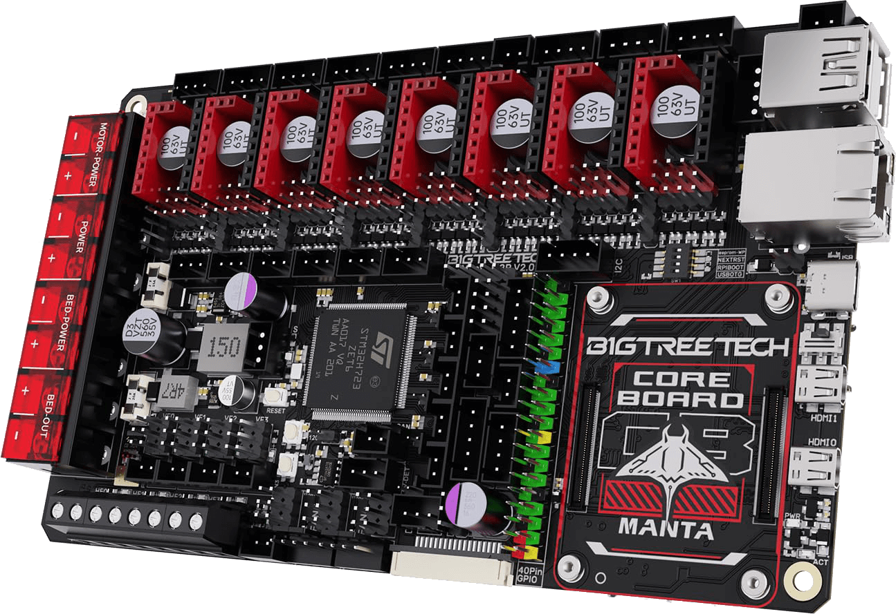

For the controller I chose the **BTT Manta M8P** board, a 32-bit control board based on the STM32G0B1VET6, a 32-bit 64MHz ARM Cortex-M0+, which offers a wide range of features and good compatibility with various open source firmware.
It is paired with the **BTT CB1** computing module (essentially a twin to the Raspberry Pi CM4), which runs Klipper and manages the **Mainsail**[<math display="inline"><sup>↗</sup></math>](https://github.com/mainsail-crew/mainsail) user interface.

The next step was selecting the stepper motors. To reuse as many components as possible from my Ender 3 Pro, I decided to keep the same **NEMA 17** motors, which have proven reliable and suitable for the needs of this project, pairing them with a dual-axis **CR 42-60** motor for the Y-axis, drawing inspiration from the Creality CR-6 Max setup.

Also from the Creality CR-6 Max I took the heated bed, which offers a large printing surface of **400x400mm** and uniform heat distribution, and the idea of adding a couple of diagonal tie rods to improve the stability of the structure.

The motors are driven by **TMC2209** drivers, known for their silent operation and advanced microstepping.

Because of the high power draw of the massive bed and dual hotends, I calculated the following power requirements:

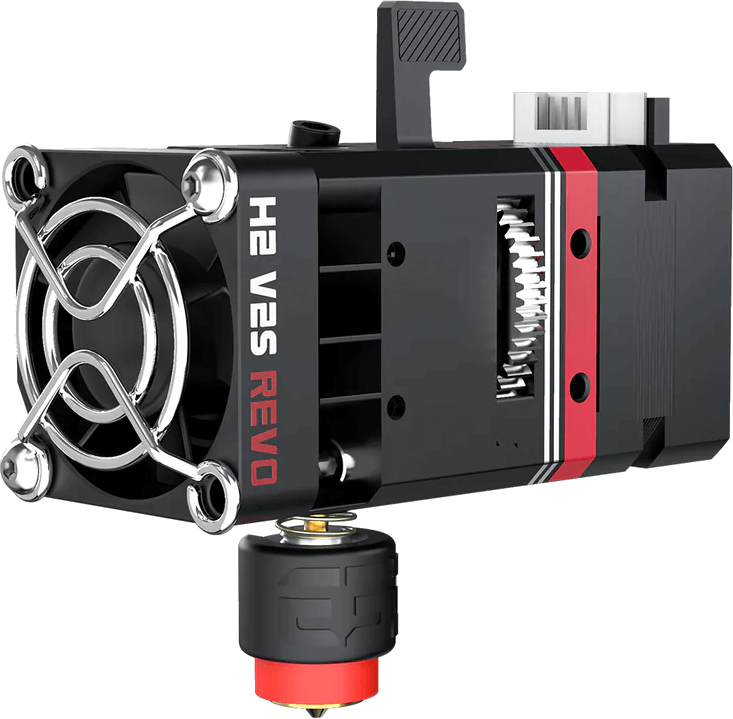

The total power required by the main components of the printer is as follows:
-**Heated Bed:** 420W @ 24V
-**2x Biqu H2 V2S REVO Hotends (up to 300°):** 40W each
-**Filament Drying System (ongoing project):** 200W
- **Other components**: motors, fans, electronics
- **Safety margin**

So, I opted for **two 24V 500W power supplies**—one dedicated solely to the bed and the other for all other components. The bed is controlled via a **Solid State Relay (SSR)** for safety and reliability.

Finally, I upgraded the bed leveling sensor from a standard probe to a **Beacon H**[<math display="inline"><sup>↗</sup></math>](https://beacon3d.com/), which uses eddy current displacement to measure distance to accurately measure the distance between the sensor and the print bed, offering much more accurate, reliable and faster calibration, especially on larger surfaces. This allowed the bed mesh to leap from a 5x5 grid to a highly accurate 30x30 matrix without needing interpolation.

<div style="display: flex; flex-direction: row; align-items: center; justify-content: center; gap: 24px;">
    <video src="res/gargantua_bed_scan.mp4" loop muted autoplay playsinline width="400px"></video>
    <figure width="400px" style="display: table">
      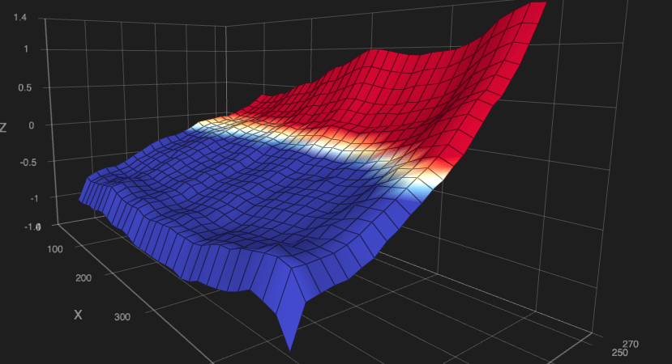
      <figcaption class="image-caption" style="display: table-caption; caption-side: bottom;" >The plate seems very tilted, but if you look carefully at the Z-axis, on 40cm of length there is only 2mm of maximum difference</figcaption>
    </figure>
</div>


### Design and Development

The printer design was done using **Fusion 360**, which allowed me to precisely design each component, simulate axis movement, and verify the integration of all hardware components. I created detailed 3D models for every part of the printer, including motor mounts, heated dish brackets, electronics mounts, and cooling components.
The development process was iterative, with frequent testing and design changes. Designing everything in CAD allowed me to identify and resolve potential compatibility and space issues before proceeding to the assembly phase, saving time and resources.
The project was initially manageable in size, but over time it was necessary to break it down into parts and combine them into a single design for when an overall view is needed. This modularity allowed for more agile development of the various components.

<figure width="400px" style="display: table;  margin-left: auto; margin-right: auto;">
    
    <figcaption style="display: table-caption; caption-side: bottom; text-align: center; font-size: 0.9em; color: #888; margin-top: 4px; font-style: italic" >Gargantua's structure</figcaption>
</figure>


#### From Bowden to Direct Drive

The Creality Ender 3 Pro uses a "bowden" extrusion system, in which the extruder is separated from the hotend and the filament is pushed through a tube to the hotend.
This approach has some advantages, such as reducing weight on the X-axis, but can present problems of reactivity and precision in extrusion, especially with flexible materials. I had already had difficulty with this system when trying to print TPU, which tended to bend inside the bowden tube, so I decided to switch to a "direct drive" system, where the extruder is mounted directly on the hotend. This change significantly improved the precision and responsiveness of the extrusion, allowing me to print a wider range of materials with greater reliability.
In designing this printer, flexibility took priority over performance; if I were to start over with a CoreXY system, I would probably opt for a bowden extrusion system, to reduce the weight on the X-axis and improve printing speed, at the cost of not being able to print flexible materials.

#### Dual Extruder

The idea of being able to print with two extruders has always fascinated me: in addition to allowing printing in 2 colors, it allows you to experiment with different materials, such as prints in which a flexible and a non-flexible material are interleaved, or to use soluble media such as PVA.
I then decided to implement it from the beginning, designing a support head for two Biqu H2 V2S REVO hotends.

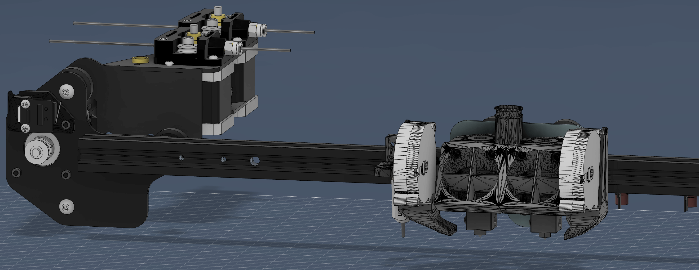
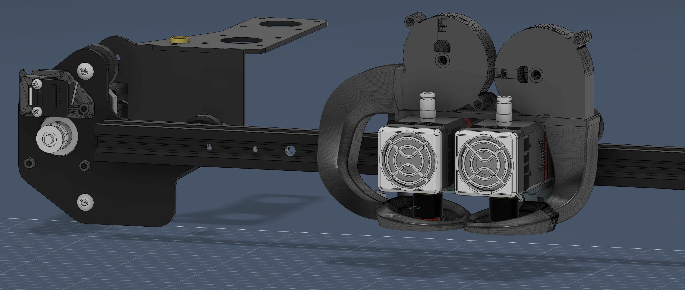

In the images above you can see the difference between the print head with bowden extruders and the one with direct drive extruders.
In the first, you can glimpse the extruders and the aeration channels to cool them (hidden fans to show the details), and in the distance on the left, the extruder motors.
In the second, however, you can see the two extruder motors mounted directly on the hotends on the print head. The metal profile where the motors for the bowden system were housed was left mounted to have an anchor for the cables going to the head.

In addition to the extruders, it can be noted that the aeration channels of the workpiece, fed by two radial fans, have also been improved, to allow for more homogeneous cooling.

#### Enclosure
To improve print quality, reduce noise during printing, and issues related to warping parts when printing materials like ABS, I decided to build a printer enclosure, a structure that completely encloses the printer, maintaining a stable internal temperature and reducing the influence of external air currents.
I already had experience building enclosures, for my Ender 3 Pro I had built what on the internet is called "IKEA Lack Enclosure"[<math display="inline"><sup>↗</sup></math>](https://www.google.com/search?q=ikea+lack+enclosure): using two overlapping IKEA Lack coffee tables, plexiglass panels for the side walls and doors, and 3D printing the various connectors.
As a first enclosure it might have been fine, but the IKEA Lack coffee table did not provide the necessary stability, and in any case it would not have been a solution applicable to a large printer like Gargantua.

For Gargantua, I drew a hollow aluminum square-section profile structure, with two ports, so that I had both front and side access to the printer.

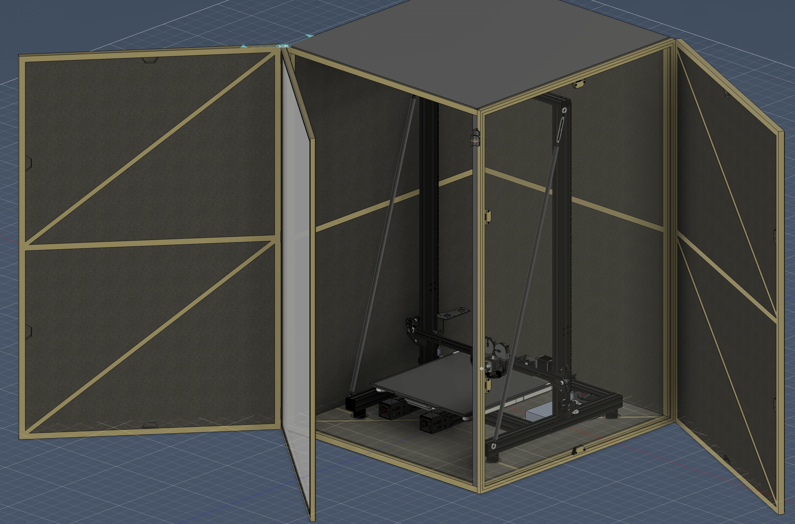

The walls and doors were then padded with insulation panels and covered with hard plastic panels.
To allow me to inspect the printing in progress without having to open the doors, I designed the doors with a double hinge, so that the outer part can be opened independently of the inner part, consisting of an aluminum frame with a transparent plexiglass panel.
Inside, the printer is attached to the enclosure through 4 rubber dampers, to reduce vibrations transmitted to the structure, which is also equipped with rubber dampers such as feet.

>ℹ️ The enclosure is necessarily non-square in base, this is to minimize the size, but leaving room for the plate to slide along the Y-axis.

A strip led system was installed on the ceiling of the enclosure, to illuminate the interior during printing and facilitate visual inspection of the printing process.

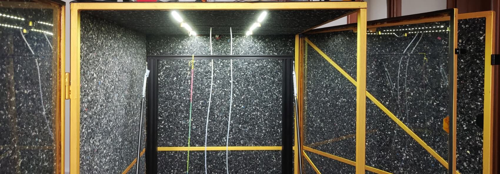

### Filament Dehumidifier

A very important and often underestimated part of 3D printing is the management of filaments, which are hygroscopic and tend to absorb moisture from the environment, resulting in a degradation of print quality. A wet filament expands and can cause under-extrusion problems, or even extruder blockages.
To address this issue, I decided to integrate a filament drying system directly above the enclosure, designing a dedicated compartment that houses 10 filaments, with a heating and ventilation system to keep the filaments dry and ready for printing.
This system is powered together with the printer, and is connected directly to the extruders, so that the dried filaments do not come into contact with external moisture on the way to the hotends.

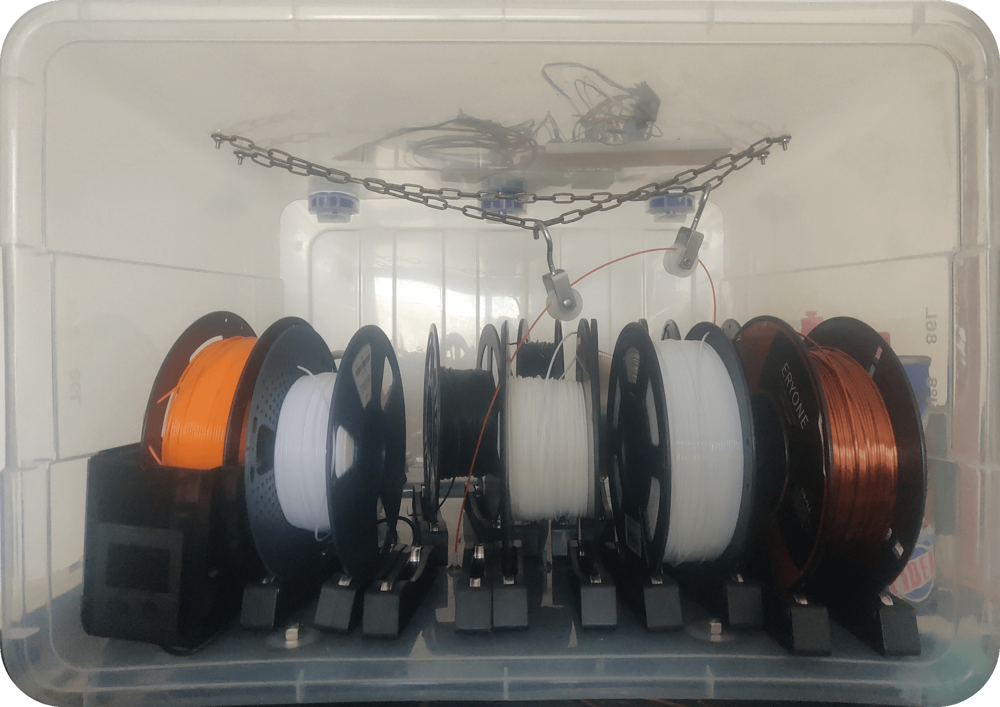

In the photo above, you can see the dehumidifier, with several filaments, and above it, you can see the heating circuit, still in the prototyping phase. In the center, a pulley system guides the filaments toward the extruders; at the bottom center, you can see the tube that carries the filaments out of the dehumidifier, toward the extruders.

The system is still in development; the circuit is ready and tested, but some modifications to the 3D design are still needed to better integrate the components and improve airflow.

### Fume Management

Printing with materials such as ABS can generate potentially harmful fumes, as well as an unpleasant odor. To improve safety and comfort during printing, I decided to integrate a smoke extraction system directly into the enclosure.
Since I didn't have access to an external exhaust, I opted for an air filtration system based on activated carbon and HEPA filters, which capture particles and neutralize odors before reintroducing air into the environment.
The filter in question is the **AlveoOne R of Alveo3D**[<math display="inline"><sup>↗</sup></math>](https://www.alveo3d.com/en/product/alveoone-r-assembled/), designed specifically for 3D printing, it filters the air present in the enclosed case.
Gargantua's firmware is configured to automatically activate the fume extraction system when fume-generating materials are printed, and to continue filtering the air for a certain period after printing has finished.

### The Name: Gargantua
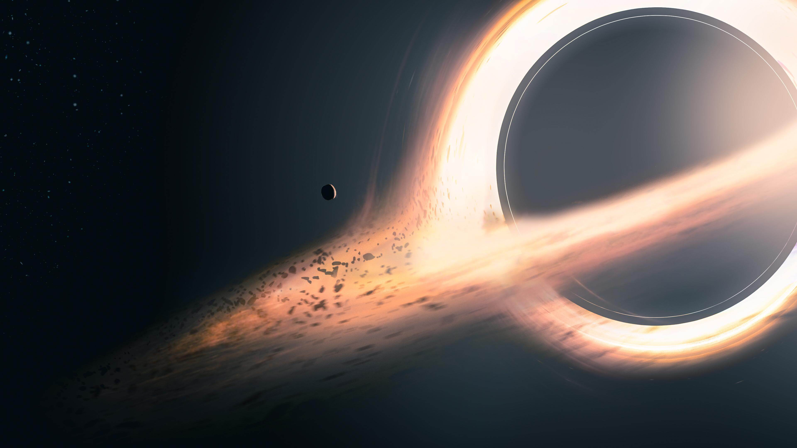
</br>

The name Gargantua was chosen in honor of the super-massive black hole depicted in Christopher Nolan's film Interstellar.
Gargantua was at the center of the film, depicted as a rotating black hole with a bright accretion disk and gravitational distortions that alter its appearance.

The name was chosen to symbolize the size and power of the printer, which, with its large print volume of **400x400x768mm** and its capabilities, represents a benchmark in my journey of learning and experimenting in the world of 3D printing.


### Lessons Learned

It would be nice to be able to say that everything went smoothly, but unfortunately it did not. This project presented numerous challenges and obstacles along the way, many of which stemmed from my inexperience in designing a 3D printer from scratch.
The main ones were 2: underestimating the temperatures inside the house and the erosion of the hotend nozzles.

The previous table-based enclosure IKEA Lack was not insulated, and the printer inside dissipated the heat generated during printing, maintaining a relatively low internal temperature.
After completing assembly and starting printing, I was pleased to see that the internal temperature of the case rose rapidly, reaching peaks of over 50°C and then remaining stable, a sign that the enclosure was doing its job.
However, this heat caused overheating problems for the electronics and power supplies, leading to malfunctions and printing interruptions.
To solve this problem, I had to drill a small hole in the back of the enclosure to move all the electronics outside, allowing for better heat dissipation.

<div style="display: flex; flex-direction: column; align-items: center;">

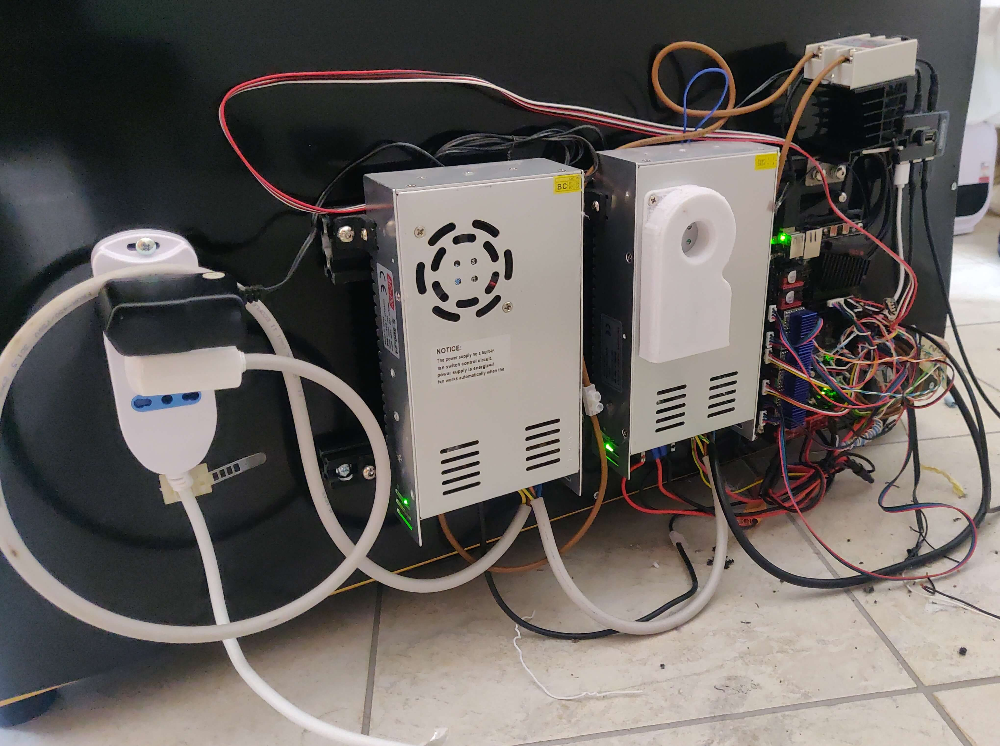
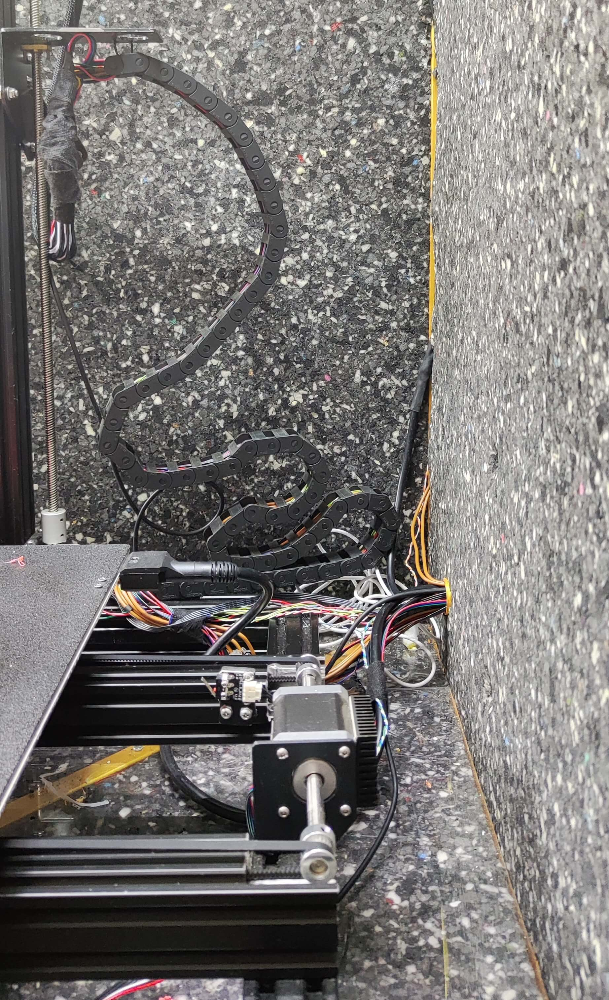
<div>
<label class="image-caption">(left) Power supplies and electronics, moved outside the case. (right) Cables inside it</label>
</div>

</div>

The second problem was the erosion of the hotend nozzles. When I made the double extruder printhead, I tried to get as much precision as possible, to make sure that the height of the two hotends was perfectly aligned.
However, the dual extruder operated for a short time: erosions from printing and nozzles that left the factory slightly higher than others made it impossible to maintain precise alignment between the two hotends. Unfortunately, the accuracy required here is quite high, ~0.1mm, and even a small difference in height between the two hotends can cause printing problems.
For this reason, I am currently printing with a single extruder, but I am working on a new print head and am evaluating several options:
- mobile extruder system, in which the extruders move up and down and are individually calibrated
- IDEX (Independent Dual Extrusion) system, in which the two extruders are completely independent and can move autonomously, completely eliminating the alignment problem.

Or maybe both!


### Results and Future Developments
This was certainly the most ambitious and complex project I have ever carried out, and despite the challenges I encountered, I am extremely satisfied with the final result.
Gargantua is a large format, powerful and versatile 3D printer, which has allowed me to explore new possibilities in 3D printing and improve my skills in design and electronics.
I can't say it's over, because this is an ever-evolving project, with new features and improvements in development, but I'm proud of what I've accomplished so far and can't wait to see where this project takes me in the future.

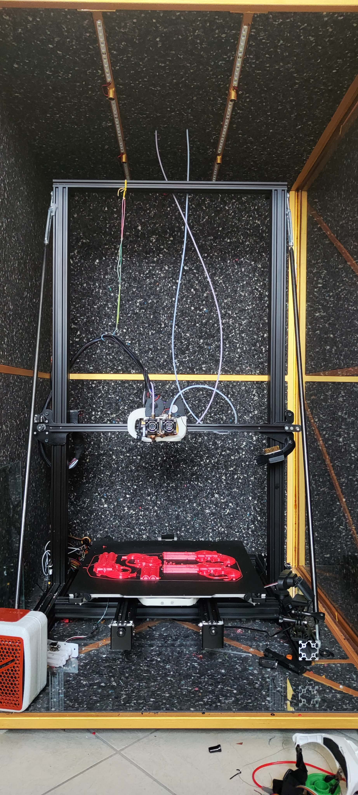
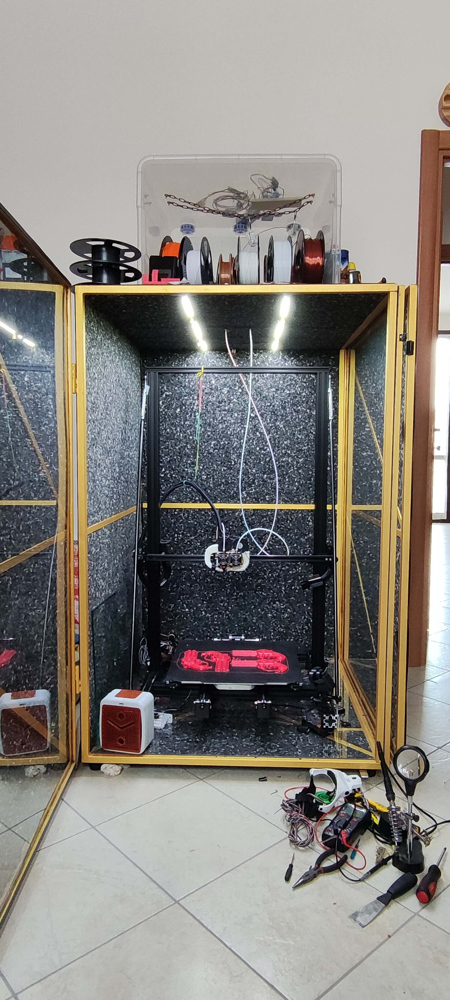
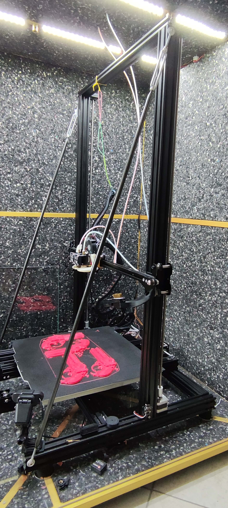

## Technologies and tools
* **Firmware:** Klipper
* **Hardware:** BTT Manta M8P, BTT CB1, NEMA 17, CR 42-60, TMC2209, SSR
* **User Interface:** Mainsail
* **Slicers:** Cura, PrusaSlicer
* **Design:** Fusion 360
